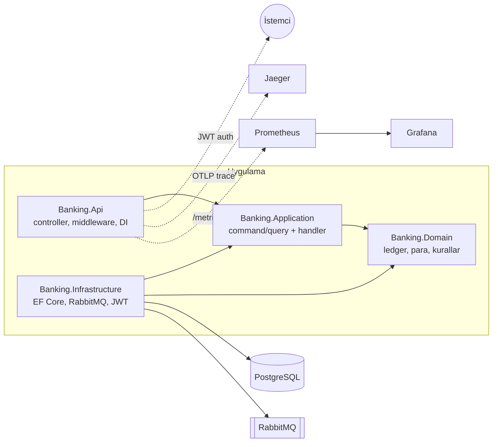

# Banking — Çift Taraflı Defterli Core Banking Backend'i


C# / ASP.NET Core ile yazılmış dijital bankacılık backend'i. Ticari bir ürün değil;
bankacılık domain'ini ve production seviyesinde .NET mimarisini gösteren bir **portföy
projesi**. Sistemin kalbi, bakiyeyi bir kolonda tutmak yerine her finansal hareketi
değişmez (immutable) defter kayıtlarından türeten **çift taraflı muhasebe defteri**
(double-entry ledger).


## Öne çıkanlar

- **Double-entry ledger** her hareket en az iki satır (borç + alacak), toplam daima sıfır;
  defter append-only, düzeltme ters kayıtla. Bakiye, satırlardan türetilir.
- **Para asla `double` değil** — `Money` value object'i (`decimal` + para birimi), aritmetik
  tek yerde.
- **Idempotent transferler** `Idempotency-Key` başlığı; aynı anahtar ikinci kez gelirse
  işlem tekrarlanmaz, ilk sonucun aynısı döner. Eşzamanlı aynı-anahtar yarışını veritabanı
  unique constraint'i çözer.
- **Optimistic locking** hesap başına versiyon sayacı; paralel transferler bakiyeyi bozamaz
  (testle kanıtlı: bakiyenin iki katı tutarında 20 paralel transfer → overdraft yok).
- **Outbox pattern**  olay, transferle aynı DB transaction'ında yazılır; background publisher
  RabbitMQ'ya publisher confirm'le basar. Uygulama çökse bile olay kaybolmaz; consumer'lar
  inbox tablosuyla dedupe yapar (at-least-once → effectively-once).
- **Risk kontrolleri** — hesap başına günlük transfer limiti, KYC durumu (doğrulanmamış hesap
  transfer gönderemez), kural tabanlı fraud taraması (eşik üstü tutar, yüksek hız) →
  `fraud_alerts`.
- **Gözlemlenebilirlik** Serilog structured log + correlation id (istekten consumer'a kadar
  taşınır), OpenTelemetry tracing (istek → handler → DB → kuyruk → consumer TEK trace),
  Prometheus metrikleri + hazır Grafana dashboard'u.
- **Kendi CQRS dispatcher'ımız** — dış kütüphane yok; `ICommand`/`IQuery` + DI'dan çözen,
  reflection'ı cache'leyen hafif bir mediator.

## Mimari

Clean Architecture; bağımlılık yönü hep içe doğru. Domain hiçbir dış pakete bağımlı değildir.



Bir transferin yolculuğu:

```
POST /api/transfers (Idempotency-Key)
  → TransferMoneyCommand → TransferPolicy (KYC, bakiye, günlük limit)
  → dengeli transaction + outbox satırı (AYNI DB transaction'ı)
  → OutboxPublisher → RabbitMQ "banking.events"
  → TransferNotificationConsumer (bildirim logu)
  → FraudScreeningConsumer (kurallar → fraud_alerts)
```

## Nasıl çalıştırılır

Gereksinimler: .NET 10 SDK, Docker.

```bash
# 1) Altyapı: PostgreSQL, RabbitMQ, Prometheus, Grafana, Jaeger
docker compose up -d

# 2) Veritabanı şeması
dotnet tool restore
ASPNETCORE_ENVIRONMENT=Development Jwt__Secret="en-az-32-byte-uzunlugunda-bir-secret" \
  dotnet ef database update -p src/Banking.Infrastructure -s src/Banking.Api

# 3) API (Prometheus 5000 portunu scrape eder)
ASPNETCORE_ENVIRONMENT=Development ASPNETCORE_URLS=http://localhost:5000 \
  Jwt__Secret="en-az-32-byte-uzunlugunda-bir-secret" \
  dotnet run --project src/Banking.Api --no-launch-profile
```

| Arayüz | Adres |
|---|---|
| API dokümantasyonu (Scalar) | http://localhost:5000/scalar/v1 |
| Grafana dashboard'u | http://localhost:3000 (anonim erişim açık) |
| Jaeger trace arayüzü | http://localhost:16686 |
| Prometheus | http://localhost:9090 |
| RabbitMQ yönetimi | http://localhost:15672 (banking / banking_dev) |

Örnek akış:

```bash
# Kayıt + giriş
curl -X POST localhost:5000/api/auth/register -H "Content-Type: application/json" \
  -d '{"email":"ayse@ornek.com","password":"Gizli123!"}'
TOKEN=$(curl -s -X POST localhost:5000/api/auth/login -H "Content-Type: application/json" \
  -d '{"email":"ayse@ornek.com","password":"Gizli123!"}' | jq -r .accessToken)

# Hesap aç + KYC tamamla
curl -X POST localhost:5000/api/accounts -H "Authorization: Bearer $TOKEN" \
  -H "Content-Type: application/json" -d '{"currencyCode":"TRY"}'
curl -X POST localhost:5000/api/accounts/<HESAP_ID>/kyc -H "Authorization: Bearer $TOKEN"

# Transfer (idempotent + correlation id)
curl -X POST localhost:5000/api/transfers -H "Authorization: Bearer $TOKEN" \
  -H "Content-Type: application/json" -H "Idempotency-Key: benzersiz-anahtar-1" \
  -H "X-Correlation-Id: benim-izim-1" \
  -d '{"sourceAccountId":"...","destinationAccountId":"...","amount":100,"currencyCode":"TRY"}'
```

Docker imajı olarak:

```bash
docker build -t banking-api .
```

## Testler

```bash
dotnet test
```

105 test, üç katman:

- **Domain birim testleri** — defter kuralları %100: dengeli kayıt, yetersiz bakiye, kapalı
  hesap, para birimi uyuşmazlığı, günlük limit, KYC, fraud kuralları.
- **Application testleri** — handler davranışları in-memory fake'lerle: idempotency replay,
  concurrency retry, outbox'a olay kuyruklanması.
- **Integration + uçtan uca testler** — **Testcontainers** her koşuda taze PostgreSQL 17 ve
  RabbitMQ 4 konteynerleri kaldırır (Docker'dan başka önkoşul yok, CI'da da aynen çalışır):
  gerçek DB'de idempotency ve paralel transfer para korunumu; outbox'ın restart'a dayanıklılığı;
  fraud işaretlemesi; ve kritik akışın **gerçek HTTP pipeline** üzerinden tamamı —
  kayıt → giriş → hesap aç → KYC → transfer → olayın iki consumer'ca işlendiğinin doğrulanması.

## Teknoloji seçimleri 

.NET ekosisteminde bazı popüler kütüphaneler ticari lisansa geçti. Bu proje bilinçli olarak
sıfır maliyetli, açık kaynak alternatiflerle kuruldu — çoğu yerde bu, daha az sihir ve daha
anlatılabilir kod demek:

| İhtiyaç | Yaygın (artık ücretli) seçenek | Bu projede | Neden |
|---|---|---|---|
| CQRS / mediator | MediatR v13+ | **Kendi dispatcher'ımız** | ~100 satır, dış bağımlılık yok, davranışı tamamen bizim |
| Mesajlaşma | MassTransit v9 | **RabbitMQ.Client** (resmî, MIT) | Outbox/inbox'ı zaten kendimiz kurduk; framework katmanına gerek yok |
| Test assertion | FluentAssertions v8 | **Shouldly** (MIT) | Aynı okunabilirlik, ücretsiz |
| Mapping | AutoMapper v15+ | **Elle mapping** | Birkaç record için kütüphane taşımaya değmez |
| Auth sunucusu | IdentityServer | **ASP.NET Core Identity + JWT Bearer** (yerleşik) | Framework'ün içinde, ücretsiz |
| Diğerleri | — | EF Core, Npgsql, FluentValidation, Serilog, OpenTelemetry, Testcontainers, xUnit | Hepsi Apache-2.0 / MIT / PostgreSQL lisansı |

Altyapı da öyle: PostgreSQL, RabbitMQ, Prometheus, Grafana OSS, Jaeger — tamamı açık kaynak,
`docker compose up` ile geliyor.

## Yapılanlar

- [x] **Aşama 0: İskelet:** 4 projeli solution, Docker Compose (PostgreSQL 17 + RabbitMQ 4)
- [x] **Aşama 1: Domain + ledger:** `Money`, `Account`, `LedgerEntry`, `Transaction`, çift
      taraflı defter, Result pattern, tüm invariant'lar
- [x] **Aşama 2: Kalıcılık:** EF Core 10 + Npgsql, migration'lar, repository + UnitOfWork
- [x] **Aşama 3: API + auth:** kendi CQRS dispatcher'ı, ASP.NET Core Identity + JWT,
      ProblemDetails hata eşleme, OpenAPI + Scalar
- [x] **Aşama 4: Transfer:** idempotency (aynı transaction'da anahtar kaydı), optimistic
      locking + retry, paralel transferde para korunumu
- [x] **Aşama 5: Asenkron olaylar:** outbox pattern, RabbitMQ publisher (confirm'li),
      inbox dedupe'lu consumer'lar, restart'a dayanıklılık
- [x] **Aşama 6: Risk:** günlük transfer limiti, KYC durumu, kural tabanlı fraud taraması +
      `fraud_alerts`
- [x] **Aşama 7: Gözlemlenebilirlik:** Serilog + correlation id, OpenTelemetry tracing
      (asenkron hop dahil tek trace), Prometheus + Grafana dashboard'u + Jaeger
- [x] **Aşama 8: Test + CI + paketleme:** Testcontainers, uçtan uca kritik akış testi,
      Dockerfile, GitHub Actions

## Proje yapısı

```
.
├── src/
│   ├── Banking.Domain           # entity'ler, value object'ler, iş kuralları — dış bağımlılık yok
│   ├── Banking.Application      # command/query + handler'lar, arayüzler, kendi dispatcher'ımız
│   ├── Banking.Infrastructure   # EF Core + PostgreSQL, RabbitMQ, outbox/inbox, Identity + JWT
│   └── Banking.Api              # controller'lar, middleware, DI, gözlemlenebilirlik pipeline'ı
├── tests/
│   ├── Banking.Domain.Tests
│   ├── Banking.Application.Tests
│   └── Banking.Api.IntegrationTests   # Testcontainers + WebApplicationFactory (uçtan uca)
├── observability/               # Prometheus config, Grafana provisioning + dashboard
├── docker-compose.yml
└── Dockerfile
```
