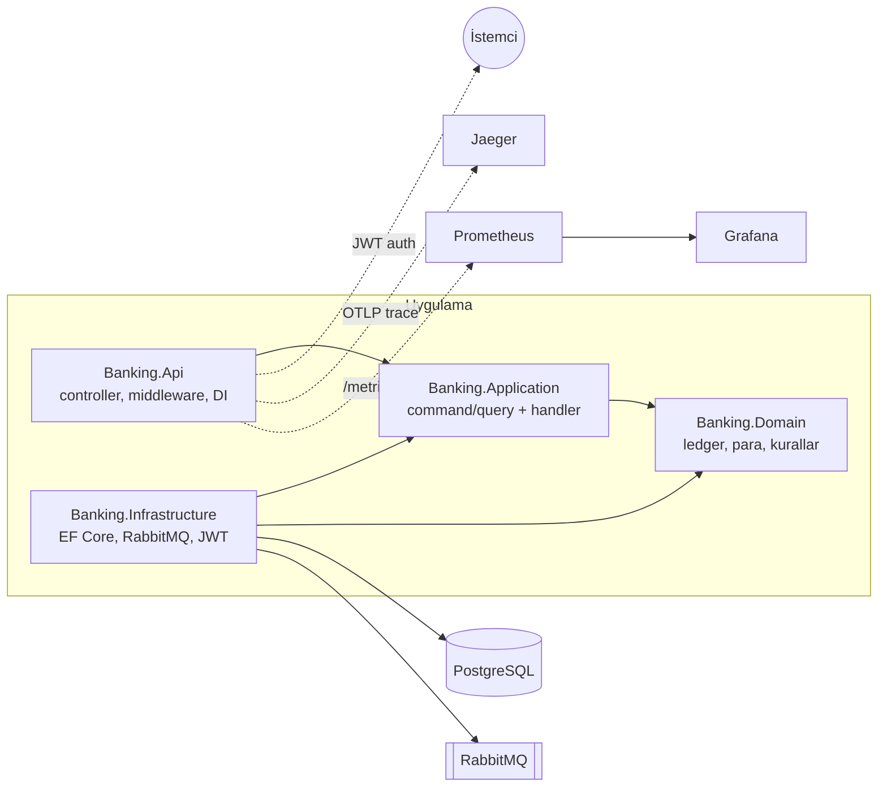

# Bankacılık Backend


ASP.NET Core ile geliştirilmiş core banking backend servisi. Hesap yönetimi, hesaplar arası
para transferi, kimlik doğrulama, asenkron olay işleme ve risk kontrolleri içerir. Bakiye
tek bir kolonda tutulmaz; tüm finansal hareketler çift taraflı muhasebe defterinde
(double-entry ledger) değişmez kayıtlar olarak saklanır ve bakiye bu kayıtlardan türetilir.

## Özellikler

- **Çift taraflı defter:** Her finansal hareket en az iki kayıt üretir (borç + alacak) ve
  toplam her zaman sıfırdır. Defter append-only'dir; düzeltmeler ters kayıtla yapılır.
- **Para modeli:** Tutarlar `decimal` tabanlı `Money` value object'i ile temsil edilir;
  para birimi uyuşmazlıkları derleme ve çalışma zamanında engellenir.
- **Idempotent transferler:** `Idempotency-Key` başlığı zorunludur. Aynı anahtarla gelen
  tekrar istekler yeni işlem yaratmaz, ilk işlemin sonucunu döndürür. Eşzamanlı aynı-anahtar
  yarışı veritabanı unique constraint'i ile çözülür.
- **Eşzamanlılık kontrolü:** Hesap başına versiyon sayacı ile optimistic locking uygulanır;
  çakışan işlemler güncel veriyle yeniden denenir. Paralel transferler altında bakiye
  tutarlılığı integration testleriyle doğrulanmıştır.
- **Outbox pattern:** Domain olayları, işlemi oluşturan veritabanı transaction'ı içinde
  outbox tablosuna yazılır; bir background service olayları RabbitMQ'ya publisher confirm
  ile yayınlar. Consumer tarafında inbox tablosu ile tekrarlanan teslimatlar ayıklanır.
- **Risk kontrolleri:** Hesap başına günlük transfer limiti, KYC durumu (doğrulanmamış
  hesaplar transfer gönderemez) ve kural tabanlı fraud taraması (eşik üstü tutar, kısa
  sürede çok sayıda transfer). Şüpheli işlemler `fraud_alerts` tablosuna işlenir.
- **Gözlemlenebilirlik:** Serilog ile yapılandırılmış loglama ve istek başına correlation id
  (kuyruk üzerinden consumer loglarına kadar taşınır), OpenTelemetry ile uçtan uca tracing
  (HTTP isteği → handler → veritabanı → kuyruk → consumer tek trace altında), Prometheus
  metrikleri ve hazır Grafana dashboard'u.
- **CQRS:** Command/query ayrımı, DI üzerinden çözümlenen hafif bir dispatcher ile
  uygulanmıştır.

## Mimari

Clean Architecture kullanılır; bağımlılık yönü daima içe doğrudur ve Domain katmanının dış
paket bağımlılığı yoktur.



Bir transferin izlediği yol:

```
POST /api/transfers (Idempotency-Key)
  → TransferMoneyCommand → TransferPolicy (KYC, bakiye, günlük limit)
  → dengeli transaction + outbox kaydı (aynı DB transaction'ı içinde)
  → OutboxPublisher → RabbitMQ "banking.events"
  → TransferNotificationConsumer (bildirim)
  → FraudScreeningConsumer (kural değerlendirmesi → fraud_alerts)
```

## Kurulum ve çalıştırma

Gereksinimler: .NET 10 SDK, Docker.

```bash
# 1) Altyapı: PostgreSQL, RabbitMQ, Prometheus, Grafana, Jaeger
docker compose up -d

# 2) Veritabanı şeması
dotnet tool restore
ASPNETCORE_ENVIRONMENT=Development Jwt__Secret="en-az-32-byte-uzunlugunda-bir-secret" \
  dotnet ef database update -p src/Banking.Infrastructure -s src/Banking.Api

# 3) API (Prometheus, 5000 portunu scrape eder)
ASPNETCORE_ENVIRONMENT=Development ASPNETCORE_URLS=http://localhost:5000 \
  Jwt__Secret="en-az-32-byte-uzunlugunda-bir-secret" \
  dotnet run --project src/Banking.Api --no-launch-profile
```

| Arayüz | Adres |
|---|---|
| API dokümantasyonu (Scalar) | http://localhost:5000/scalar/v1 |
| Grafana | http://localhost:3000 |
| Jaeger | http://localhost:16686 |
| Prometheus | http://localhost:9090 |
| RabbitMQ yönetim arayüzü | http://localhost:15672 |

Örnek kullanım:

```bash
# Kayıt ve giriş
curl -X POST localhost:5000/api/auth/register -H "Content-Type: application/json" \
  -d '{"email":"ornek@ornek.com","password":"Gizli123!"}'
TOKEN=$(curl -s -X POST localhost:5000/api/auth/login -H "Content-Type: application/json" \
  -d '{"email":"ornek@ornek.com","password":"Gizli123!"}' | jq -r .accessToken)

# Hesap açma ve KYC
curl -X POST localhost:5000/api/accounts -H "Authorization: Bearer $TOKEN" \
  -H "Content-Type: application/json" -d '{"currencyCode":"TRY"}'
curl -X POST localhost:5000/api/accounts/<HESAP_ID>/kyc -H "Authorization: Bearer $TOKEN"

# Transfer
curl -X POST localhost:5000/api/transfers -H "Authorization: Bearer $TOKEN" \
  -H "Content-Type: application/json" -H "Idempotency-Key: benzersiz-anahtar-1" \
  -d '{"sourceAccountId":"...","destinationAccountId":"...","amount":100,"currencyCode":"TRY"}'
```

Docker imajı:

```bash
docker build -t banking-api .
```

## Testler

```bash
dotnet test
```

Test paketi üç katmandan oluşur (105 test):

- **Domain birim testleri:** Defter kuralları — dengeli kayıt, yetersiz bakiye, kapalı hesap,
  para birimi uyuşmazlığı, günlük limit, KYC ve fraud kuralları.
- **Application testleri:** Handler davranışları — idempotency replay, çakışmada yeniden
  deneme, outbox'a olay kuyruklanması.
- **Integration ve uçtan uca testler:** Testcontainers her koşuda geçici PostgreSQL 17 ve
  RabbitMQ 4 konteynerleri başlatır; Docker dışında önkoşul yoktur ve CI'da aynı şekilde
  çalışır. Gerçek veritabanında idempotency, paralel transferlerde bakiye tutarlılığı,
  outbox'ın uygulama yeniden başlatmasına dayanıklılığı ve kayıt → giriş → hesap açma →
  transfer → olayın consumer'larca işlenmesi akışının tamamı doğrulanır.

## Teknolojiler

| Alan | Teknoloji |
|---|---|
| Framework | .NET 10, ASP.NET Core |
| Veritabanı | PostgreSQL 17, EF Core, Npgsql |
| Mesajlaşma | RabbitMQ, RabbitMQ.Client |
| Kimlik doğrulama | ASP.NET Core Identity, JWT Bearer |
| Loglama / izleme | Serilog, OpenTelemetry, Prometheus, Grafana, Jaeger |
| Test | xUnit, Shouldly, Testcontainers |
| API dokümantasyonu | OpenAPI, Scalar |
| CI | GitHub Actions |

## Proje yapısı

```
.
├── src/
│   ├── Banking.Domain           # entity'ler, value object'ler, iş kuralları
│   ├── Banking.Application      # command/query handler'ları, arayüzler, dispatcher
│   ├── Banking.Infrastructure   # EF Core, RabbitMQ, outbox/inbox, Identity, JWT
│   └── Banking.Api              # controller'lar, middleware, DI, telemetri
├── tests/
│   ├── Banking.Domain.Tests
│   ├── Banking.Application.Tests
│   └── Banking.Api.IntegrationTests
├── observability/               # Prometheus ve Grafana yapılandırmaları
├── docker-compose.yml
└── Dockerfile
```
