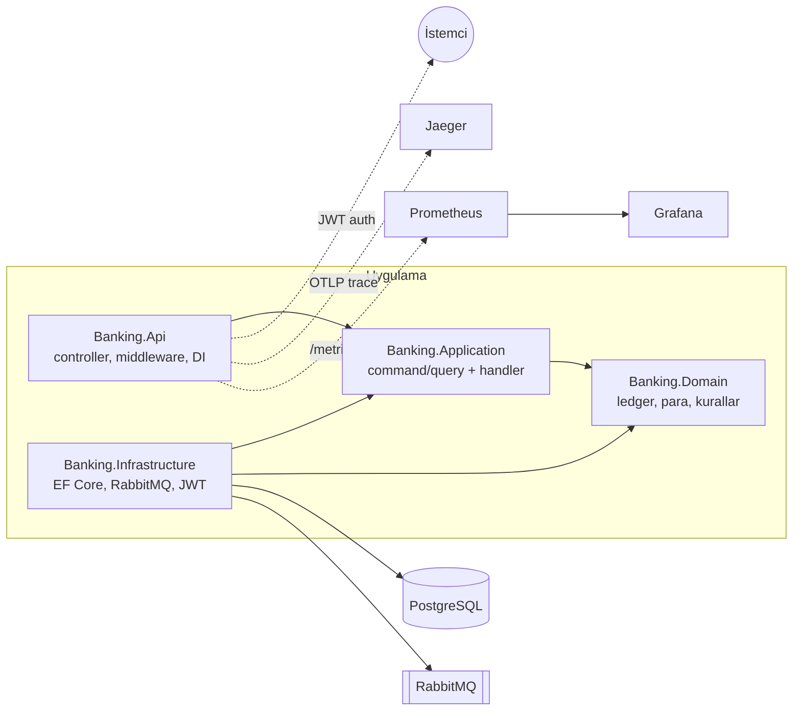

# Bankacılık Backend


ASP.NET Core ile geliştirilmiş core banking backend servisi. Hesap yönetimi, hesaplar arası
para transferi, kimlik doğrulama, asenkron olay işleme ve risk kontrolleri içerir. Bakiye
tek bir kolonda tutulmaz; tüm finansal hareketler çift taraflı muhasebe defterinde
(double-entry ledger) değişmez kayıtlar olarak saklanır ve bakiye bu kayıtlardan türetilir.

## Özellikler

- **Çift taraflı defter:** Her finansal hareket en az iki kayıt üretir (borç + alacak) ve
  toplam her zaman sıfırdır. Defter append-only'dir; düzeltmeler **ters kayıtla (reversal)**
  yapılır: `POST /api/transactions/{id}/reversal` orijinali değiştirmez, tüm bacakları ters
  çevrilmiş dengeleyici bir işlem ekler. Bir işlem en fazla bir kez ters çevrilebilir
  (unique index ile garanti).
- **Para modeli:** Tutarlar `decimal` tabanlı `Money` value object'i ile temsil edilir;
  para birimi uyuşmazlıkları derleme ve çalışma zamanında engellenir. Bakiyenin kaynağı
  her zaman defterdir; okuma tarafında `account_balances` **projeksiyonu** kullanılır —
  defter yazımıyla AYNI veritabanı transaction'ında güncellenen, tamamen türetilmiş ve
  defterden her an yeniden inşa edilebilir bir read model (okuma `SUM` yerine O(1)).
- **Hesap yaşam döngüsü:** hesap açma, para yatırma/çekme (`/deposits`, `/withdrawals` —
  kasa hesabına karşı çift taraflı kayıt), sayfalı ekstre (`GET /api/accounts/{id}/transactions`),
  bakiye sıfırken kapatma (`POST /api/accounts/{id}/close`).
- **Idempotent para hareketleri:** Transfer, yatırma ve çekmede `Idempotency-Key` başlığı
  zorunludur. Aynı anahtarla gelen tekrar istekler yeni işlem yaratmaz, ilk işlemin sonucunu
  döndürür. Eşzamanlı aynı-anahtar yarışı veritabanı unique constraint'i ile çözülür.
- **Eşzamanlılık kontrolü:** Hesap başına versiyon sayacı ile optimistic locking uygulanır;
  çakışan işlemler güncel veriyle yeniden denenir. Paralel transferler altında bakiye
  tutarlılığı integration testleriyle doğrulanmıştır.
- **Outbox pattern + DLQ:** Domain olayları, işlemi oluşturan veritabanı transaction'ı içinde
  outbox tablosuna yazılır; bir background service olayları RabbitMQ'ya publisher confirm
  ile yayınlar. Consumer tarafında inbox tablosu ile tekrarlanan teslimatlar ayıklanır;
  iki kez işlenemeyen (poison) mesajlar kaybolmaz, `banking.dead-letters` kuyruğuna düşer.
  Outbox/inbox/idempotency tabloları bir retention job'ı ile periyodik temizlenir.
- **Kimlik doğrulama:** JWT access token + **refresh token rotation** (`POST /api/auth/refresh`;
  kullanılmış token tekrar sunulursa kullanıcının tüm oturumları iptal edilir; veritabanında
  yalnızca token hash'i durur). Auth endpoint'lerinde IP başına **rate limiting** ile
  brute-force koruması.
- **Doğrulama pipeline'ı:** FluentValidation validator'ları, kendi CQRS dispatcher'ımızın
  içinde handler'dan önce çalışır; geçersiz komut handler'a hiç ulaşmaz ve domain'le aynı
  makine-okunur hata kodlarıyla reddedilir.
- **Health check'ler:** `/health/live` (process ayakta mı) ve `/health/ready`
  (PostgreSQL + RabbitMQ erişilebilir mi).
- **Risk kontrolleri:** Hesap başına günlük transfer limiti, KYC durumu (doğrulanmamış
  hesaplar transfer gönderemez) ve kural tabanlı fraud taraması (eşik üstü tutar, kısa
  sürede çok sayıda transfer). Şüpheli işlemler `fraud_alerts` tablosuna işlenir.
- **Fraud inceleme akışı:** İşaretlenen işlemler back-office endpoint'lerinden yönetilir:
  `GET /api/fraud-alerts` (durum filtresi + sayfalama) ve
  `POST /api/fraud-alerts/{id}/resolve` (Confirmed/Dismissed + not). Bu uçlar müşteri
  değil **rol** korumalıdır (`fraud-reviewer` JWT rolü); bir uyarı tam bir kez karara
  bağlanır, karar sonradan değiştirilemez.
- **Düzenli transfer (standing order):** "Her ay A'dan B'ye X gönder" talimatı
  (`POST/GET /api/standing-orders`, `/cancel`). Vadesi gelen talimatları bir background
  service normal transfer olarak yürütür; her tekrar **deterministik idempotency key**
  taşıdığından executor çökse ve aynı tekrarı yeniden işlese bile para iki kez çıkmaz.
  Başarısız tekrar (yetersiz bakiye vb.) talimat üzerinde görünür kalır, plan ilerler.
- **Gözlemlenebilirlik:** Serilog ile yapılandırılmış loglama ve istek başına correlation id
  (kuyruk üzerinden consumer loglarına kadar taşınır), OpenTelemetry ile uçtan uca tracing
  (HTTP isteği → handler → veritabanı → kuyruk → consumer tek trace altında), Prometheus
  metrikleri ve hazır Grafana dashboard'u.
- **CQRS:** Command/query ayrımı, DI üzerinden çözümlenen hafif bir dispatcher ile
  uygulanmıştır.

## Mimari

Clean Architecture kullanılır; bağımlılık yönü daima içe doğrudur ve Domain katmanının dış
paket bağımlılığı yoktur.



Bir transferin izlediği yol:

```
POST /api/transfers (Idempotency-Key)
  → TransferMoneyCommand → TransferPolicy (KYC, bakiye, günlük limit)
  → dengeli transaction + outbox kaydı (aynı DB transaction'ı içinde)
  → OutboxPublisher → RabbitMQ "banking.events"
  → TransferNotificationConsumer (bildirim)
  → FraudScreeningConsumer (kural değerlendirmesi → fraud_alerts)
```

Önemli mimari kararlar ve gerekçeleri (neden double-entry, neden kendi CQRS
dispatcher'ımız, neden outbox, optimistic vs. pessimistic locking vb.)
[docs/adr](docs/adr/README.md) altında ADR formatında belgelenmiştir.

## Kurulum ve çalıştırma

Gereksinimler: .NET 10 SDK, Docker.

```bash
# 1) Altyapı: PostgreSQL, RabbitMQ, Prometheus, Grafana, Jaeger
docker compose up -d

# 2) Veritabanı şeması
dotnet tool restore
ASPNETCORE_ENVIRONMENT=Development Jwt__Secret="en-az-32-byte-uzunlugunda-bir-secret" \
  dotnet ef database update -p src/Banking.Infrastructure -s src/Banking.Api

# 3) API (Prometheus, 5000 portunu scrape eder)
ASPNETCORE_ENVIRONMENT=Development ASPNETCORE_URLS=http://localhost:5000 \
  Jwt__Secret="en-az-32-byte-uzunlugunda-bir-secret" \
  dotnet run --project src/Banking.Api --no-launch-profile
```

| Arayüz | Adres |
|---|---|
| API dokümantasyonu (Scalar) | http://localhost:5000/scalar/v1 |
| Grafana | http://localhost:3000 |
| Jaeger | http://localhost:16686 |
| Prometheus | http://localhost:9090 |
| RabbitMQ yönetim arayüzü | http://localhost:15672 |

Örnek kullanım:

```bash
# Kayıt ve giriş
curl -X POST localhost:5000/api/auth/register -H "Content-Type: application/json" \
  -d '{"email":"ornek@ornek.com","password":"Gizli123!"}'
TOKEN=$(curl -s -X POST localhost:5000/api/auth/login -H "Content-Type: application/json" \
  -d '{"email":"ornek@ornek.com","password":"Gizli123!"}' | jq -r .accessToken)

# Hesap açma ve KYC
curl -X POST localhost:5000/api/accounts -H "Authorization: Bearer $TOKEN" \
  -H "Content-Type: application/json" -d '{"currencyCode":"TRY"}'
curl -X POST localhost:5000/api/accounts/<HESAP_ID>/kyc -H "Authorization: Bearer $TOKEN"

# Para yatırma ve bakiye (bakiye defterden türetilir)
curl -X POST localhost:5000/api/accounts/<HESAP_ID>/deposits -H "Authorization: Bearer $TOKEN" \
  -H "Content-Type: application/json" -H "Idempotency-Key: yatir-1" \
  -d '{"amount":1000,"currencyCode":"TRY"}'
curl localhost:5000/api/accounts/<HESAP_ID> -H "Authorization: Bearer $TOKEN"

# Transfer
curl -X POST localhost:5000/api/transfers -H "Authorization: Bearer $TOKEN" \
  -H "Content-Type: application/json" -H "Idempotency-Key: benzersiz-anahtar-1" \
  -d '{"sourceAccountId":"...","destinationAccountId":"...","amount":100,"currencyCode":"TRY"}'

# Ekstre ve ters kayıt
curl "localhost:5000/api/accounts/<HESAP_ID>/transactions?page=1&pageSize=20" \
  -H "Authorization: Bearer $TOKEN"
curl -X POST localhost:5000/api/transactions/<ISLEM_ID>/reversal -H "Authorization: Bearer $ALICI_TOKEN"
```

Docker imajı:

```bash
docker build -t banking-api .
```

Ücretsiz katmanlarda (Render + Neon + CloudAMQP) canlı demo yayınlamak için
[docs/deploy.md](docs/deploy.md) adımlarını izleyin.

## Testler

```bash
dotnet test
```

Test paketi dört katmandan oluşur (173 test):

- **Domain birim testleri:** Defter kuralları — dengeli kayıt, yetersiz bakiye, kapalı hesap,
  para birimi uyuşmazlığı, günlük limit, KYC, fraud kuralları ve çözümleme yaşam döngüsü,
  standing order zamanlaması ve ters kayıt (reversal) politikası.
- **Application testleri:** Handler davranışları — idempotency replay, çakışmada yeniden
  deneme, outbox'a olay kuyruklanması, yatırma/çekme, hesap kapatma, reversal, fraud
  inceleme, standing order sahiplik kuralları ve dispatcher'ın validation pipeline'ı.
- **Mimari testleri:** NetArchTest ile Clean Architecture bağımlılık kuralları derleme
  sonrası doğrulanır — Domain hiçbir dış pakete referans veremez, Application
  Infrastructure/EF Core/ASP.NET Core göremez, controller'lar use case katmanını atlayamaz.
  Yanlış yönde eklenen bir referans CI'da testi kırar.
- **Integration ve uçtan uca testler:** Testcontainers her koşuda geçici PostgreSQL 17 ve
  RabbitMQ 4 konteynerleri başlatır; Docker dışında önkoşul yoktur ve CI'da aynı şekilde
  çalışır. Gerçek veritabanında idempotency, paralel transferlerde bakiye tutarlılığı,
  outbox'ın uygulama yeniden başlatmasına dayanıklılığı, poison mesajın dead-letter
  kuyruğuna düşmesi, retention temizliği, refresh token rotation'ı, rate limiting,
  fraud inceleme döngüsü (işaretle → listele → karara bağla), standing order'ın
  crash-and-rerun altında tam bir kez yürümesi, bakiye projeksiyonunun defterle birebir
  eşleşmesi ve kayıt → giriş → yatır → transfer → ters kayıt → kapatma akışlarının
  tamamı doğrulanır.

## Performans

`loadtest/transfer-load.js` k6 senaryosu, 10 sanal kullanıcıyla 30 saniye boyunca
transfer endpoint'ini yükler (her kullanıcının kendi fonlanmış hesap çifti vardır) ve
sonunda **para korunumunu** doğrular. Yerel ölçüm (Release build, tam pipeline:
idempotency kaydı + optimistic locking + outbox + RabbitMQ tüketicileri açık):

| Metrik | Değer |
|---|---|
| Transfer sayısı (30 sn) | 6.148 |
| Ortalama hız | ~205 istek/sn |
| Gecikme p50 / p95 / maks | 37 ms / 108 ms / 322 ms |
| Hata oranı | %0 |
| Para korunumu | Tüm hesap çiftlerinde doğrulandı |

Çalıştırmak için (API 5000 portunda ayaktayken):

```bash
docker run --rm -i --add-host=host.docker.internal:host-gateway grafana/k6 run - < loadtest/transfer-load.js
```

## Teknolojiler

| Alan | Teknoloji |
|---|---|
| Framework | .NET 10, ASP.NET Core |
| Veritabanı | PostgreSQL 17, EF Core, Npgsql |
| Mesajlaşma | RabbitMQ, RabbitMQ.Client |
| Doğrulama | FluentValidation |
| Kimlik doğrulama | ASP.NET Core Identity, JWT Bearer (+ refresh token rotation) |
| Loglama / izleme | Serilog, OpenTelemetry, Prometheus, Grafana, Jaeger |
| Test | xUnit, Shouldly, Testcontainers, NetArchTest |
| Yük testi | k6 |
| API dokümantasyonu | OpenAPI, Scalar |
| CI | GitHub Actions |

## Proje yapısı

```
.
├── src/
│   ├── Banking.Domain           # entity'ler, value object'ler, iş kuralları
│   ├── Banking.Application      # command/query handler'ları, arayüzler, dispatcher
│   ├── Banking.Infrastructure   # EF Core, RabbitMQ, outbox/inbox, Identity, JWT
│   └── Banking.Api              # controller'lar, middleware, DI, telemetri
├── tests/
│   ├── Banking.Domain.Tests
│   ├── Banking.Application.Tests
│   ├── Banking.ArchitectureTests    # bağımlılık kuralları (NetArchTest)
│   └── Banking.Api.IntegrationTests
├── docs/adr/                    # mimari karar kayıtları
├── loadtest/                    # k6 yük testi senaryosu
├── observability/               # Prometheus ve Grafana yapılandırmaları
├── docker-compose.yml
└── Dockerfile
```
